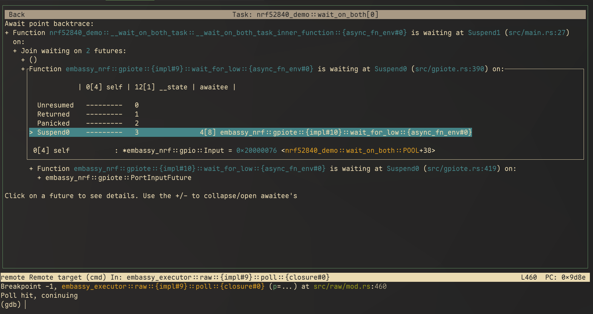

# Embassy Inspect
TUI to help debug embedded async rust projects using the embassy executor.

# What it does

Embassy inspect is meant to help when some tasks seem to be stuck somewhere, but when debugging with
GDB the instruction pointer is just waiting in the sleep instruction.

# Running inside GDB
See `./gdb_backend/README.md`
