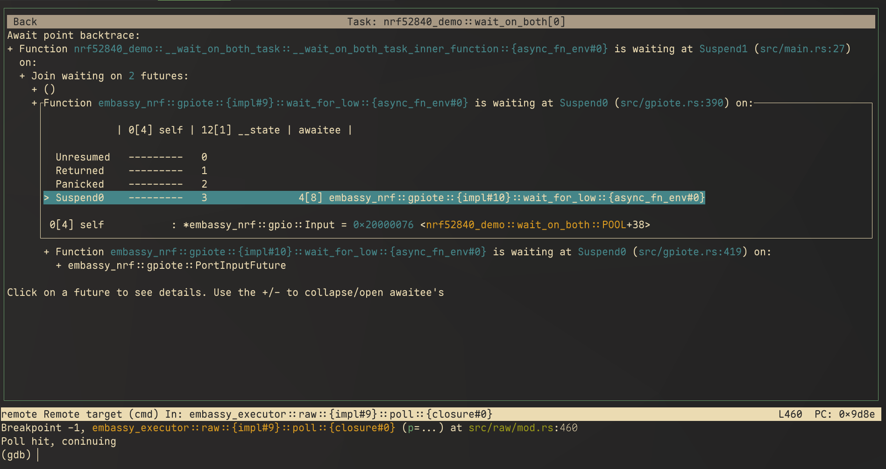

> [!IMPORTANT]
> This project is a prototype at the moment and is only guaranteed to work with embassy-executor
> version 0.8.0 without the nightly feature and rust version 1.89.0

# Inspect-embassy
TUI to help debug embedded async rust projects using the embassy executor.

## What it does

The main page of inspect-embassy gives an overview of what embassy tasks are spawned and at what
await point they are waiting. Clicking on a specific task brings you to the "backtrace" for that
task.

Every line is a single future, futures from async functions show at what await point they last
polled Pending. Futures waiting on other futures (like an await point in an async fn) show those as
children in the tree view. Futures like `Join` and `Select` can have multiple children. When only
some of the `Join` futures have polled ready their value is shown as a child line.

Futures without any special handling are also just show their value.

## When to use it

Inspect-embassy is most useful when some async function seems to be stuck but trying to debug via a
traditional debugger just shows the instruction pointer at the sleep function. Inspect-embassy can
then show you where in the stack of async functions the tasks are waiting.

## How to use it
At the moment their exists two backends, a GDB backend and a probe-rs backend:

- probe-rs backend, see [`./probe_rs_backend/README.md`](./probe_rs_backend/README.md) for install instructions
  - Easy to install
  - Can't use other debugging features
  - No pretty printing of types
- GDB backend, see [`./gdb_backend/README.md`](./gdb_backend/README.md) for install instructions
  - Use GDB at the same time as inspect-embassy
  - Make use of GDB pretty printers
  - Kinda annoying to install as it is a GDB extension

## Architecture documentation
See [`./docs/Architecture.md`](./docs/Architecture.md) for a description of the
architecture of this project.

